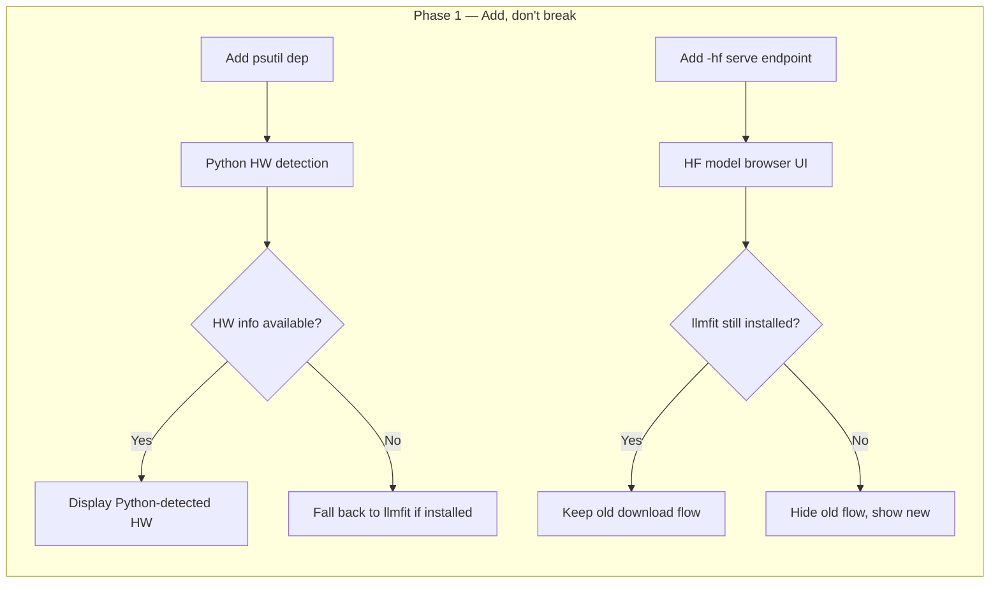
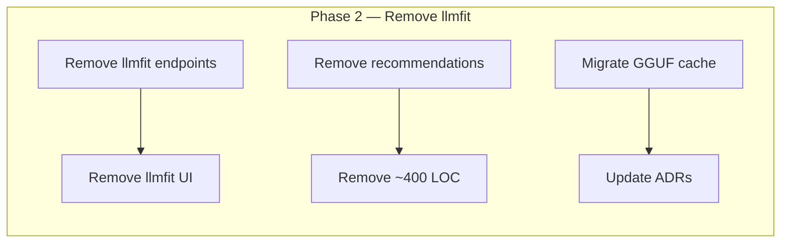

# ADR-0020: Remove llmfit Dependency — Adopt `llama-server -hf` Flag and Python Hardware Detection

## Status

**Accepted**

**Version:** 1.2
**Last Updated:** 2026-06-27

## Context

### Current llmfit Usage

ADR-0005 chose **llmfit** (AlexsJones/llmfit, Rust, ~5.8 MB static binary) as the solution for three distinct functions:

1. **Hardware detection** — `llmfit system --json` returns GPU type, VRAM, CPU cores, RAM, platform info. Used by the Settings → Local Models tab to display hardware information.

2. **Model recommendations** — `llmfit recommend --json` returns a scored list of models with hardware-fit percentages. Displayed in the "Recommended Models (llmfit)" card in the Settings UI.

3. **GGUF model download** — `llmfit download <repo> --output-dir ~/.cache/llmfit/models/` is the mechanism for downloading GGUF files. Used by `POST /api/local-backends/models/download`.

ADR-0018 (Native llama.cpp Backend, §Negative, line 515) explicitly noted:

> "Still dependent on llmfit for GGUF downloads (llama.cpp's `-hf` flag could be an alternative in the future)"

And in §Open Questions (line 602):

> "Should we support the `-hf` flag for direct HuggingFace downloads via llama-server? → Decision: deferred. Use llmfit for downloads; `-hf` is a future enhancement."

### Problems with llmfit

The llmfit integration has accumulated several issues that make its continued use fragile and costly:

| # | Issue | Impact | Reference |
|---|-------|--------|-----------|
| 1 | **Download progress stuck at 3%** | `llmfit download` output parsing is fragile — progress events get stuck at 3% for most models, confusing users | #101 |
| 2 | **REST violations** | `llmfit install` and `llmfit uninstall` use HTTP GET for mutation (`GET /api/local-backends/llmfit/install`), violating REST conventions | #110 |
| 3 | **12/15 recommended models can't be downloaded** | The recommendation engine suggests models that `llmfit download` fails to fetch. Only 3 of 15 recommended models actually download successfully | #102 |
| 4 | **External Rust binary** | ~5.8 MB binary, platform availability constraints, opaque CLI changes, maintenance burden. ADR-0005 §Risks warned: "If llmfit changes CLI interface, integration must be updated" | ADR-0005 |
| 5 | **No active upstream maintenance** | llmfit has low commit frequency; no guarantees of API stability or issue resolution | — |

### Why `-hf` Is Now Viable

llama.cpp's `llama-server` binary (already managed per ADR-0018) supports a native `-hf` flag that downloads and serves models directly from HuggingFace Hub:

```bash
# Single command: download + serve
llama-server -hf <user>/<model>[:quant]

# Example
llama-server -hf bartowski/Llama-3.2-3B-Instruct-GGUF:Q4_K_M
```

Key capabilities:

- **First load:** Downloads model from HuggingFace Hub, caches to `~/.cache/huggingface/hub/`, then loads and serves
- **Subsequent loads:** Uses HF cache directly — no re-download
- **Quantization selection:** Optional `:quant` suffix picks specific quantization (e.g., `Q4_K_M`, `Q6_K`)
- **Download progress:** On first load, download progress is captured from the `llama-server` subprocess stderr output and streamed as SSE to the frontend (not a llama-server REST API)
- **Model querying:** `GET /models` returns currently loaded/running models (not a cache listing)
- **Built into llama-server:** No external binary, no separate download step

This eliminates the need for a separate download tool entirely — `-hf` combines download and serving into one operation.

### Python Hardware Detection Feasibility

The three data points provided by `llmfit system --json` are straightforward to collect with standard Python libraries:

| Data Point | Python Implementation |
|------------|----------------------|
| Platform | `platform.system()`, `platform.machine()` |
| CPU cores | `os.cpu_count()` |
| RAM | `psutil.virtual_memory().total` |
| NVIDIA GPU | Subprocess `nvidia-smi --query-gpu=name,memory.total,driver_version --format=csv,noheader` |
| AMD GPU | Subprocess `rocm-smi --showproductname` (if available) |
| PyTorch GPU | `torch.cuda.is_available()` / `torch.cuda.get_device_properties(0)` (optional, if torch is installed) |

`psutil` is a well-maintained, pure-Python library (no binary dependency) that is already a transitive dependency in most Python environments. For GPU detection, the `nvidia-smi` subprocess approach is the same pattern llmfit itself uses internally.

## Documentation

### `psutil` (Python hardware detection — RAM)

- **URL:** <https://github.com/giampaolo/psutil>
- **Key APIs:** `psutil.virtual_memory().total`, `psutil.virtual_memory().available`
- **Minimum version:** 5.9.0 (add `psutil>=5.9.0` to `pyproject.toml`)
- Pure-Python, no binary compilation step, ~1 MB install size

### `llama-server` (`-hf` flag)

- **Project:** llama.cpp — see ADR-0018 for full lifecycle documentation
- **Key feature:** `llama-server -hf <user>/<model>[:quant]` downloads from HuggingFace Hub and serves in one command
- **Build requirement:** `LLAMA_CURL=ON` (default in GitHub Releases binaries since Q2 2025)

## Decision

Replace the three llmfit-provided functions with three independent, simpler solutions:

### 1. Python Hardware Detection (Replaces `llmfit system --json`)

Implement a `get_hardware_info()` function using only stdlib + `psutil`:

```python
import os
import platform
import shutil
import subprocess

def get_hardware_info() -> dict:
    """Detect hardware without llmfit. Tiered: required → recommended → optional."""
    info = {
        "platform": platform.system(),
        "architecture": platform.machine(),
        "cpu_cores": os.cpu_count(),
        "cpu_model": platform.processor() or platform.machine(),
    }

    # Tier 2 — RAM detection (requires psutil)
    try:
        import psutil
        info["ram_total_gb"] = round(psutil.virtual_memory().total / (1024**3), 1)
        info["ram_available_gb"] = round(psutil.virtual_memory().available / (1024**3), 1)
    except ImportError:
        info["ram_total_gb"] = None
        info["ram_available_gb"] = None

    # Tier 3 — NVIDIA GPU detection
    nvidia_smi = shutil.which("nvidia-smi")
    if nvidia_smi:
        try:
            result = subprocess.run(
                [nvidia_smi, "--query-gpu=name,memory.total,driver_version",
                 "--format=csv,noheader,nounits"],
                capture_output=True, text=True, timeout=5
            )
            if result.returncode == 0 and result.stdout.strip():
                parts = result.stdout.strip().split(", ")
                info["gpu"] = {
                    "name": parts[0],
                    "vram_mb": int(parts[1]),
                    "driver": parts[2],
                    "vendor": "nvidia",
                }
        except (subprocess.TimeoutExpired, ValueError, IndexError):
            pass

    # Tier 3 — AMD GPU detection
    rocm_smi = shutil.which("rocm-smi")
    if rocm_smi:
        try:
            result = subprocess.run(
                [rocm_smi, "--showproductname"],
                capture_output=True, text=True, timeout=5
            )
            if result.returncode == 0:
                info["gpu"] = {"vendor": "amd", "detected_via": "rocm-smi"}
        except subprocess.TimeoutExpired:
            pass

    # Tier 4 — PyTorch CUDA detection (optional, best-effort)
    try:
        import torch
        info["torch_available"] = True
        info["torch_cuda_available"] = torch.cuda.is_available()
        if torch.cuda.is_available():
            props = torch.cuda.get_device_properties(0)
            info["gpu"] = {
                "name": props.name,
                "vram_mb": round(props.total_memory / (1024**2)),
                "vendor": "nvidia",
                "detected_via": "torch",
            }
    except ImportError:
        info["torch_available"] = False
        info["torch_cuda_available"] = False

    return info
```

**Tiered approach:**
- **Tier 1 (required):** platform, CPU cores — stdlib only, always available
- **Tier 2 (recommended):** RAM detection — requires `psutil` (add to dependencies)
- **Tier 3 (enhanced):** GPU detection via `nvidia-smi` or `rocm-smi` subprocess — if available on PATH
- **Tier 4 (optional):** PyTorch GPU info — if `torch` is installed in the environment

### 2. Drop Model Recommendations (Replaces `llmfit recommend --json`)

Remove the model recommendation engine entirely. The recommendation data was unreliable (12/15 models undownloadable per #102) and provided marginal value over user choice.

**Compensation for users:**
- Add a **"Browse GGUF Models"** link in the Settings → Local Models tab pointing to `https://huggingface.co/models?library=gguf`
- Add a **guidance card** with tips for selecting quantization levels based on available RAM/VRAM
- Suggest using `llama-server --fit` for auto-tuning context size and GPU layers to available hardware

### 3. Use `llama-server -hf` for Model Serving (Replaces `llmfit download`)

Replace the `llmfit download → manual serve` two-step flow with a single `llama-server -hf` operation:

**Before (current flow):**
```
User clicks "Download" → llmfit download <model> → file lands in ~/.cache/llmfit/models/
User clicks "Serve" → llama-server -m <path> → model loads
```

**After (new flow):**
```
User enters HF repo + quantization → llama-server -hf <user>/<model>:<quant>
                                                     ↓
                                        (downloads if not cached, then serves)
```

**API endpoint changes:**

| Method | Old Endpoint | New Endpoint |
|--------|-------------|--------------|
| `POST` | `/api/local-backends/models/download` (llmfit) | `/api/local-backends/llamacpp/serve-hf` (llama-server `-hf`) |
| `GET` | `/api/local-backends/models/gguf` (scan cache dir) | `/api/local-backends/llamacpp/models` (query `GET /models`) |

**Hardware check before serving:** Use `llama-server --fit` as the primary mechanism — it auto-tunes context size and GPU layers to available hardware at startup, requiring no upfront estimation.

> **Optional enhancement (Phase 2):** For a pre-flight warning before `llama-server` starts, the HuggingFace API (`https://huggingface.co/api/models/<user>/<model>`) can be queried for file size, then multiplied by a 1.2× overhead factor and compared against available RAM + VRAM. This is non-blocking — the `--fit` flag handles runtime tuning regardless.

### Two-Phase Migration Strategy

#### Phase 1 (Next Release): Add, Don't Break

| Change | Detail |
|--------|--------|
| Add `psutil` to `pyproject.toml` | Lightweight pure-Python dependency |
| Implement `get_hardware_info()` | Python HW detection module |
| Add `-hf` serve endpoint | `POST /api/local-backends/llamacpp/serve-hf` |
| Add HF model browser guidance | Link + guidance card in Settings UI |
| **Keep old llmfit endpoints** | Marked as deprecated, functional |

#### Phase 2 (Subsequent Release): Remove

| Change | Detail |
|--------|--------|
| Remove `llmfit install` endpoint | `POST /api/local-backends/llmfit/install` |
| Remove `llmfit uninstall` endpoint | `POST /api/local-backends/llmfit/uninstall` |
| Rewrite model download | Use `POST /api/local-backends/llamacpp/serve-hf` instead of `llmfit download` |
| Remove recommendations endpoint | `GET /api/tools/recommendations` |
| Remove recommendations UI | "Recommended Models (llmfit)" card |
| Update `/api/tools/status` | Remove llmfit from status response |
| Clean up old cache | Migrate `~/.cache/llmfit/models/` → `~/.cache/huggingface/hub/` or remove |
| Remove llmfit download code | `POST /api/local-backends/models/download` |

## Consequences

### Positive

1. ✅ **Removes external dependency** — No more 5.8 MB Rust binary; no CLI change risk; no platform availability constraints
2. ✅ **Fixes #101** — Download progress stuck at 3% is eliminated because `-hf` streams stderr progress output as SSE to the frontend
3. ✅ **Fixes #110** — No more REST violations (GET for mutation); `-hf` serve uses proper POST semantics
4. ✅ **Fixes #102** — 12/15 undownloadable recommendations becomes irrelevant; users download directly from HuggingFace which has reliable infrastructure
5. ✅ **Simpler UX** — "Download then serve" two-step becomes one-step "serve with HF model". Less UI surface, fewer state transitions.
6. ✅ **~400 LOC removed** — All llmfit-specific endpoints, SSE handlers, output parsers, and frontend cards are deleted in Phase 2
7. ✅ **HF cache reuse** — `~/.cache/huggingface/hub/` is shared with other HF tools; no duplicate downloads
8. ✅ **Better HW detection** — `nvidia-smi` direct call is more reliable than `llmfit system --json` output parsing
9. ✅ **No sudo install** — llmfit removal also removes the need to install an external binary; `psutil` comes via pip

### Negative

1. ❌ **No more model recommendations** — Users lose hardware-aware model scoring. Mitigation: HuggingFace GGUF filter + guidance card
2. ❌ **New `psutil` dependency** — Lightweight pure-Python, but still an added dependency. Mitigation: it's ~1MB, no binary compilation, already a transitive dep in many environments
3. ❌ **First-load latency** — `-hf` downloads on first use, so the first "serve" click takes longer. Mitigation: subprocess stderr output is captured and streamed as SSE progress events to the frontend
4. ❌ **Requires `LLAMA_CURL=ON`** — llama-server must be built with curl support for `-hf` to work. The pre-built binaries on GitHub Releases have curl enabled by default since Q2 2025, but users building from source must pass `-DLLAMA_CURL=ON`.
5. ❌ **HF API dependency** — Model listing and download depend on HuggingFace Hub availability. Mitigation: local cache serves subsequent loads even if HF is down; user can still use `-m <local-gguf>` as fallback.
6. ❌ **No offline model browsing** — "Browse GGUF Models" link requires internet. Mitigation: local GGUF files remain servable via existing `POST /api/local-backends/llamacpp/serve` endpoint.

## Risks & Mitigations

| Risk | Impact | Mitigation |
|------|--------|------------|
| `llama-server -hf` flag changes or is removed upstream | Serving via HF breaks | Fall back to existing `-m <local-gguf>` flow. Pin llama-server version in install process. |
| `LLAMA_CURL=OFF` build for user-compiled llama-server | `-hf` not available | Detect `-hf` support via `llama-server --help \| grep -q '\-hf'` before showing the HF serve UI. Show helpful error if missing. |
| HuggingFace Hub outage | Cannot download new models | Cached models still work. Local GGUF upload/`-m` flow remains as fallback. |
| `psutil` installation fails | RAM detection returns null | Tier 2 gracefully degrades — platform + CPU info still available. Log warning. |
| `nvidia-smi` not on PATH | GPU not detected | Degrade gracefully — no GPU info shown. Suggest installing NVIDIA drivers. |
| User has existing `~/.cache/llmfit/models/` GGUF files | Orphaned files after migration | Phase 2 cleanup should offer to migrate or delete. Existing `-m` serve path still works for manual loading. |
| `-hf` downloads wrong quantization | Wrong file size, poor performance | Show quantization selector in UI. Default to `Q4_K_M` (best tradeoff). Allow override via `-m` flag. |
| HF rate limiting on download | Server fails to download | llama-server retries with backoff. Show error in SSE stream. User can retry. |

## Updates to Other ADRs

### ADR-0005 (Auto-Install & Discover Local LLM Backends)

Add a deprecation note to ADR-0005:

- **All Phase 3 llmfit sections** (called "Fase 2b" in ADR-0005 — Model Recommendations, "Fase 2d" — Local Backend Management's llmfit parts) are superseded by ADR-0020
- The `llmfit` tool integration (§Tool Integration → llmfit) is deprecated
- Hardware detection (§Hardware-Aware Model Recommendations) is replaced by Python `psutil` + `nvidia-smi` approach
- The `GET /api/tools/recommendations` endpoint and `GET /api/hardware` endpoint will be removed in Phase 2
- The frontend components (`#installLlmfitBtn`, `#uninstallLlmfitBtn`, model recommendations card, `llmfitRecStatus` badge) will be removed in Phase 2

### ADR-0018 (Native llama.cpp Backend)

Resolve the deferred decision from ADR-0018 §Open Questions (line 602):

- **Question**: "Should we support the `-hf` flag for direct HuggingFace downloads via llama-server?"
- **Previous status**: Deferred. Use llmfit for downloads; `-hf` is a future enhancement.
- **New status**: **Accepted.** `-hf` is the primary model acquisition mechanism. llmfit download is deprecated.
- **Impact on ADR-0018 phases**: The GGUF model directory (`~/.cache/llmfit/models/`) referenced in ADR-0018 §GGUF Model Directory will be replaced by `~/.cache/huggingface/hub/`. The `GET /api/local-backends/models/gguf` endpoint will be updated to also scan the HF cache (see cache structure note in Phase 2 below — the HF cache uses `blobs/` + `snapshots/` layout, not a flat directory). The `POST /api/local-backends/llamacpp/serve` endpoint gains a new `hf_model` parameter alongside the existing `model` parameter.

## Files Affected

| File | Phase 1 Change | Phase 2 Change |
|------|----------------|----------------|
| `pyproject.toml` | Add `psutil` dependency | — |
| `src/deepresearch/web/server.py` | Add `/api/local-backends/llamacpp/serve-hf` endpoint. Add `get_hardware_info()` module. | Remove llmfit endpoints. Remove `/api/tools/recommendations`. Update `/api/tools/status`. Rewrite model download. |
| `src/deepresearch/web/static/js/api.js` | Add `serveHfModel()` | Remove `fetchModelRecommendations()`, `getLlmfitInstallURL()`, `uninstallLlmfit()` |
| `src/deepresearch/web/static/js/views/settings.js` | Add HF model browser UI. Add `loadHardwareInfo()` using new Python HW detection. | Remove `loadModelRecommendations()`, llmfit install/uninstall handlers. Remove `llmfitRecStatus` references. |
| `src/deepresearch/web/dashboard.html` | Add HF serve form in llama.cpp card. | Remove `#installLlmfitBtn`, `#uninstallLlmfitBtn`, `#llmfitInstallLog`, model recommendations card. |
| `tests/test_web.py` | Add tests for `serve-hf` endpoint | Remove llmfit endpoint tests |
| `tests/test_local_backends.py` | Add tests for Python HW detection | Remove llmfit-related tests |
| `tests/test_llamacpp.py` | Add tests for `-hf` serve flow | — |
| `docs/adr/ADR-0005-auto-install-and-discover-local-llm-backends.md` | — | Add deprecation note |
| `docs/adr/ADR-0018-native-llamacpp-backend-integration.md` | — | Update §Open Questions to mark `-hf` decision as Accepted |

## Implementation Phases

### Phase 1: Add — New Functionality Alongside Existing (Next Release)

**Goal:** Deploy Python hardware detection and `-hf` serving without breaking existing llmfit-dependent functionality.



**Backend changes:**
1. Add `psutil>=5.9.0` to `pyproject.toml` dependencies
2. Create `src/deepresearch/hardware.py` with `get_hardware_info()` function (tiered detection)
3. Add `POST /api/local-backends/llamacpp/serve-hf` endpoint:
   - Accepts `{"hf_repo": "user/model", "quant": "Q4_K_M", "port": 8080, ...}`
   - Validates `-hf` support in llama-server binary
   - Runs `llama-server -hf user/model:quant` with SSE progress streaming
   - Hardware pre-check: estimate memory vs available RAM/VRAM
4. Update `GET /api/local-backends/llamacpp/status` to report `-hf` support

**Frontend changes (following the reactive patterns defined in ADR-0019):**
1. Add HF model input in the llama.cpp card: repo field + quantization dropdown + "Serve from HF" button
2. Add hardware info display driven by Python detection (with fallback to llmfit)
3. Add "Browse GGUF Models" link → `https://huggingface.co/models?library=gguf`
4. Add quantization guidance card (tooltip or collapsible section)
5. Mark existing llmfit UI elements as deprecated (subtle badge)

**Testing:**
1. Test `get_hardware_info()` with mocked `nvidia-smi`, `psutil`, `platform`
2. Test `POST /api/local-backends/llamacpp/serve-hf` with mocked subprocess
3. Test graceful degradation when `psutil` is missing (unlikely in Phase 1 since it's a dep, but good for robustness)
4. Verify existing llmfit tests still pass

### Phase 2: Remove — Clean Up llmfit (Subsequent Release)

**Goal:** Remove all llmfit code, endpoints, and UI elements.



**Backend changes:**
1. Remove `POST /api/local-backends/llmfit/install`
2. Remove `POST /api/local-backends/llmfit/uninstall`
3. Remove `GET /api/tools/recommendations`
4. Remove `GET /api/hardware` (replaced by new Python detection at same or different endpoint)
5. Remove llmfit download from `POST /api/local-backends/models/download`; replace with `-hf` call
6. Update `GET /api/tools/status` — remove `llmfit` from the response
7. Update `GET /api/local-backends/models/gguf` — also scan `~/.cache/huggingface/hub/` (see cache structure note below — use `scan_cache()` or resolve via `refs/` manifest rather than flat directory walking)
8. Clean up `_llamacpp_config` — remove llmfit cache references

**Frontend changes:**
1. Remove `#installLlmfitBtn` and `#uninstallLlmfitBtn` from dashboard.html
2. Remove `#llmfitInstallLog` container
3. Remove model recommendations card from Local Models tab
4. Remove `llmfitRecStatus` badge from settings.js
5. Remove `fetchModelRecommendations()`, `getLlmfitInstallURL()`, `uninstallLlmfit()` from api.js
6. Remove llmfit references from settings.js state management
7. Update hardware info section to use only Python detection

**Cache migration:**
- Offer to migrate `~/.cache/llmfit/models/*.gguf` to `~/.cache/huggingface/hub/` (Phase 2 cleanup)
- Or leave existing GGUF files in place (they still work via `-m <path>`)
- Remove `~/.cache/llmfit/` directory if empty after migration

> **Note on HF cache structure:** The HuggingFace Hub cache uses a content-addressable store with `blobs/` (content-addressed files) and `snapshots/` (symlink trees per revision) subdirectories — not a flat directory. When scanning for GGUF files, use the `huggingface_hub` library's `scan_cache()` utility rather than naive directory walking, or resolve snapshots via the `refs/` manifest.

**Documentation:**
1. Update ADR-0005: add deprecation note referencing ADR-0020
2. Update ADR-0018: mark `-hf` deferred decision as resolved — Accepted
3. Update ADR README.md index

## Related ADRs

| ADR | Relationship |
|-----|--------------|
| [ADR-0005](ADR-0005-auto-install-and-discover-local-llm-backends.md) | Parent ADR — chose llmfit for HW detection, recommendations, and downloads. This ADR supersedes those decisions. |
| [ADR-0018](ADR-0018-native-llamacpp-backend-integration.md) | Established llama-server lifecycle. Deferred `-hf` decision. This ADR resolves that. |
| [ADR-0019](ADR-0019-frontend-reactivity-strategy.md) | Frontend reactivity patterns for the HF serve UI. |

## Changelog

| Date | Version | Changes |
|------|---------|---------|
| 2026-06-25 | 1.0 | Initial version — proposed |
| 2026-06-27 | 1.2 | Promoted from Proposed to Accepted after Phase 1 + Phase 2 implementation and review. Status changed to Accepted. |
| 2026-06-25 | 1.1 | Review fixes: corrected `POST /models`/`GET /models` capabilities (M1), added HF cache structure notes (M2), made `--fit` primary HW check (M3), added Documentation section (S1), ADR-0019 reference (S2), fixed "Fase" spelling (S3) — approved by Reviewers |
